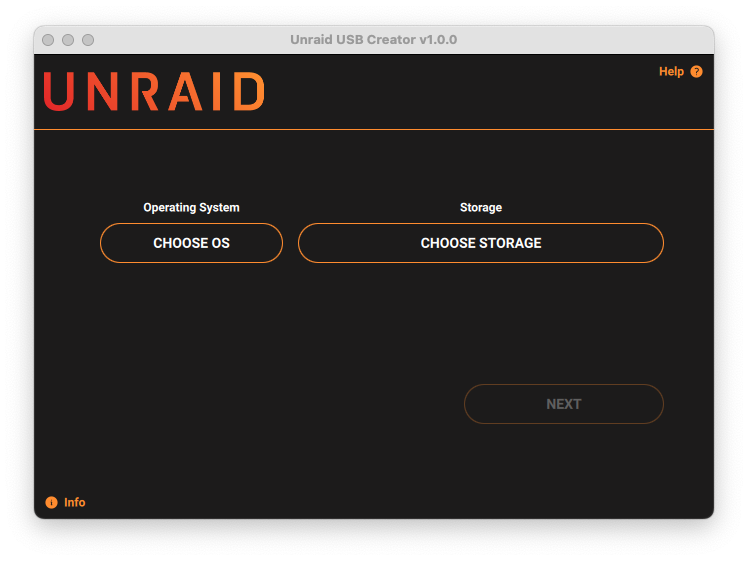
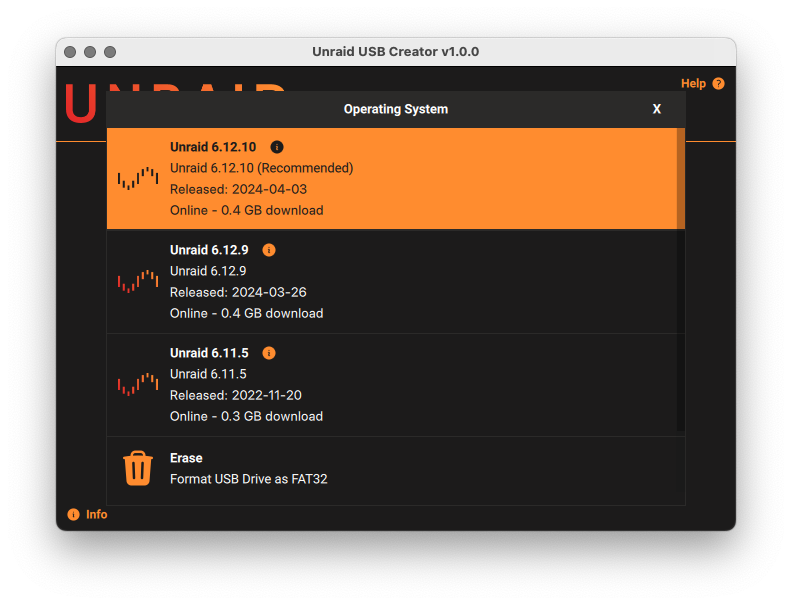
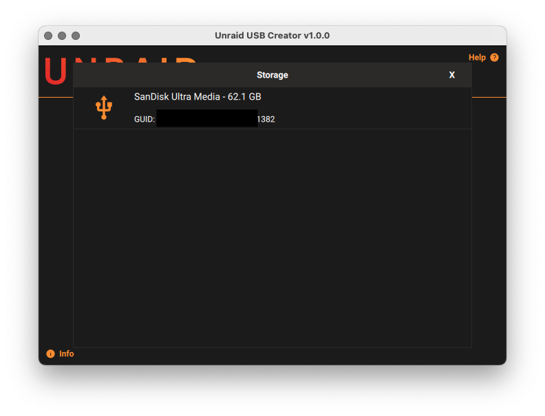
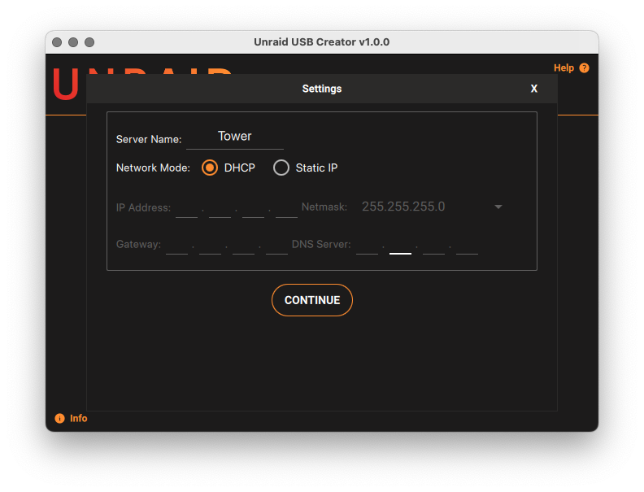
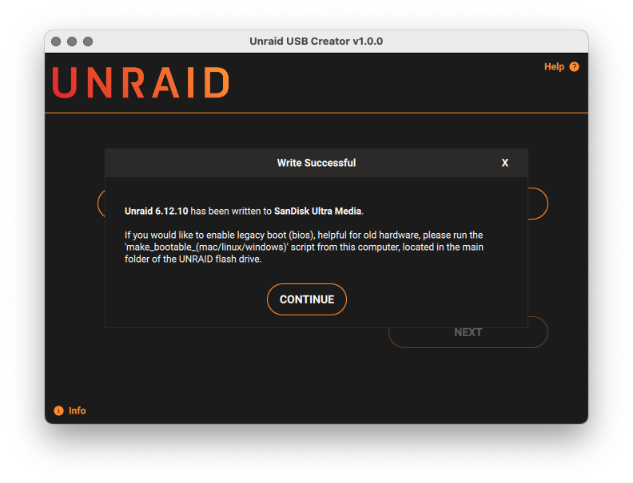

# Unraid USB Creator

Unraid USB Creation Utility

Download the latest version for Windows, macOS and Ubuntu from the [USB Creator Download Page](https://unraid.net/getting-started/).
 


## How to use Raspberry Pi Imager

Based on the work by [Raspberry Pi](https://github.com/raspberrypi/rpi-imager)

## How to use the Unraid USB Creator

Please see our [official documentation](https://docs.unraid.net/legacy/FAQ/usb-flash-drive-preparation/).

## Contributing

### Linux

#### Get dependencies

- Install the build dependencies (Debian used as an example):

```sh
sudo apt install --no-install-recommends build-essential cmake git libgnutls28-dev
```

#### Get the source

```sh
git clone --depth 1 https://github.com/unraid/usb-creator-next
```

#### Build Qt

```sh
sudo ./build-qt.sh
```

This will build and install the version of Qt preferred for Raspberry Pi Imager into /opt/Qt/<version>. You must use `sudo` for the installation step to complete.

#### Build the AppImage

```sh
./create-appimage.sh
./Raspberry_Pi_Imager-*.AppImage
```

### Windows

#### Get Windows dependencies

- Get the Qt online installer from: https://www.qt.io/download-open-source
  - During installation, choose Qt 6.9 with Mingw64 64-bit toolchain.
- For building the installer, install Inno Setup scriptable install system: https://jrsoftware.org/isdl.php
- Install Visual Studio Code (or a derivative) and the Qt Extension Pack.
- It is assumed you already have a valid code signing certificate, and the Windows 10 Kit (SDK) installed.

#### Building on Windows

Building Raspberry Pi Imager on Windows is best done with Visual Studio Code (or a derivative).

- Open Visual Studio Code, and select 'Clone repo'. Give it the git url of this project.
- Open the CMake plugin settings, and set the following Configure Args:
  - `-DQt6_ROOT=C:\Qt\6.9.0\mingw_64` - or the equivalent path you installed Qt 6.9 to.
  - `-DMINGW64_ROOT=C:\Qt\Tools\mingw1310_64` - or the equivalent path you installed mingw64 to.
  - `-DENABLE_INNO_INSTALLER=ON` - to enable the Inno Setup installer, rather than the legacy NSIS installer.
  - `-DIMAGER_SIGNED_APP=ON` - to enable code signing for redistribution.
- In the CMake plugin tab, ensure you have selected the `MinSizeRel` variant if you intend to distribute to others.
- In the CMake plugin tab, select the 'inno_installer' target, and build it
- Your resultant installer will be located in `%WORKSPACE%\build\installer`

#### Signing

To sign the .exe installer on Windows, [follow these instructions](https://github.com/unraid/digicert-keylockertools) (private repo)

### macOS

#### Get macOS dependencies

- Get the Qt online installer from: https://www.qt.io/download-open-source
  - During installation, choose Qt 6.9.
- Install Visual Studio Code (or a derivative), and the Qt Extension Pack.
- It is assumed you have an Apple developer subscription, and already have a "Developer ID" code signing certificate for distribution outside the Mac Store.

#### Building on Mac

<<<<<<< HEAD
Building Raspberry Pi Imager on macOS is best done with Visual Studio Code (or a derivative).
=======
<<<<<<< HEAD
Building Raspberry Pi Imager on Windows is best done with Visual Studio Code (or a derivative).
=======
- Download source .zip from github and extract it to a folder on disk
- Start Qt Creator (may need to start "finder" navigate to home folder using the "Go" menu, and find Qt folder to start it manually as it may not have created icon in Applications), and open src/CMakeLists.txt
- Menu "Build" -> "Build all"
- Result will be in build_unraid-usb-creator_someversion
- Install create-dmg for signing `brew install create-dmg`

#### Signing on Mac

For distribution to others:

1. code sign the .app
2. create a DMG
3. submit the DMG for notarization to Apple
4. staple the notarization ticket to the DMG.
>>>>>>> f22862a9 (chore(docs): add screenshots to readme)
>>>>>>> e7b342f1 (chore(docs): add screenshots to readme)

- Open Visual Studio Code, and select 'Clone repo'. Give it the git url of this project.
- Open the CMake plugin settings, and set the following Configure Args:
  - `-DQt6_ROOT=/opt/Qt6/6.9.0/gcc_arm64` - or the equivalent path you installed Qt 6.9 to.
  - `-DIMAGER_SIGNED_APP=ON` - to enable code signing.
  - `-DIMAGER_SIGNING_IDENTITY=$cn` - to specify the Developer ID Certificate Common Name.
  - `-DIMAGER_NOTARIZE_APP=ON` - to enable automatic notarization for distribution to others.
  - `-DIMAGER_NOTARIZE_KEYCHAIN_PROFILE=notarytool-password` - specify the name of the keychain item containing your Apple ID credentials for notarizing.
- In the CMake plugin tab, ensure you have selected the `MinSizeRel` variant if you intend to distribute to others.
- In the CMake plugin tab, select the 'rpi_imager' target, and build it
- Your resultant DMG will be located at `$WORKSPACE/build/Raspberry Pi Imager-$VERSION.dmg`

### Linux embedded (netboot) build

The embedded build runs under a minimalistic Linux distribution compiled by buildroot.
To build:

- You must be running a Linux system, and have the buildroot dependencies installed as listed in the buildroot manual: https://buildroot.org/downloads/manual/manual.html#requirement
- Run:

```sh
cd rpi-imager/embedded
./build.sh
```

The result will be in the "output" directory.
The files can be copied to a FAT32 formatted SD card, and inserted in a Pi for testing.
If you would like to build a (signed) netboot image there are tools for that at: https://github.com/raspberrypi/usbboot/tree/master/tools

## Other notes

### Custom repository

If the application is started with "--repo [your own URL]" it will use a custom image repository.
So can simply create another 'start menu shortcut' to the application with that parameter to use the application with your own images.

### Telemetry

In order to understand usage of the application (e.g. uptake of Raspberry Pi Imager versions and which images and operating systems are most popular) when using the default image repository, the URL, operating system name and category (if present) of a selected image are sent along with the running version of Raspberry Pi Imager, your operating system, CPU architecture, locale and Raspberry Pi revision (if applicable) to https://rpi-imager-stats.raspberrypi.com by downloadstatstelemetry.cpp.

This web service is hosted by [Heroku](https://www.heroku.com) and only stores an incrementing counter using a [Redis Sorted Set](https://redis.io/topics/data-types#sorted-sets) for each URL, operating system name and category per day in the `eu-west-1` region and does not associate any personal data with those counts. This allows us to query the number of downloads over time and nothing else.

The last 1,500 requests to the service are logged for one week before expiring as this is the [minimum log retention period for Heroku](https://devcenter.heroku.com/articles/logging#log-history-limits).

On Windows, you can opt out of telemetry by disabling it in the Registry:

```pwsh
reg add "HKCU\Software\Raspberry Pi\Imager" /v telemetry /t REG_DWORD /d 0
```

On Linux, run `rpi-imager --disable-telemetry` or add the following to `~/.config/Raspberry Pi/Imager.conf`:

```ini
[General]
telemetry=false
```

On macOS, disable it by editing the property list for the application:

```sh
defaults write org.raspberrypi.Imager.plist telemetry -bool NO
```

### License

The main code of the Imaging Utility is made available under the terms of the Apache license.
See license.txt and files in "src/dependencies" folder for more information about the various open source licenses that apply to the third-party dependencies used such as Qt, libarchive, drivelist, mountutils and libcurl.
For the embedded (netboot) build see also "embedded/legal-info" for more information about the extra system software included in that.
Telemetry is currently disabled on the Unraid USB Creator
### Images

#### Homepage


#### OS Selection



#### Drive Selection

Blacklisted


Good Drive


#### Options Selection



#### Writing in Progress


#### Success


