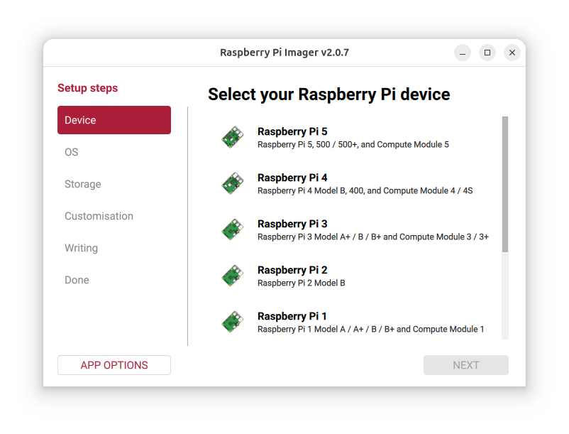

# Unraid USB Creator

Writes Unraid OS to a USB flash drive, and personalises it before first boot —
server name, network configuration and Wi-Fi — so the server comes up ready on
your network.

- Download for Windows, macOS and Linux from the
  [releases page](https://github.com/unraid/usb-creator-next/releases).
- New to Unraid? Start with the
  [Unraid documentation](https://docs.unraid.net/unraid-os/getting-started/).

## Unraid flash drives and licensing

An Unraid licence is bound to a GUID derived from the USB flash drive's vendor
id, product id and serial number. The creator shows that GUID next to each drive
so you can check it before writing, and tells you when a GUID is already
registered — in that case the drive still works, and the server may still be
licensable using TPM.

Unraid boots from USB flash specifically, so only USB devices are offered as
targets.

## Legacy BIOS boot

The drive this produces boots on UEFI systems as written. Older BIOS-only
hardware also needs a syslinux boot sector, which is **not** installed
automatically. To add it, run the matching script from the root of the drive:

| Platform | Script |
|---|---|
| Windows | `make_bootable.bat` (as administrator) |
| macOS | `make_bootable_mac` |
| Linux | `make_bootable_linux` |

## Development

See [CONTRIBUTING.md](./CONTRIBUTING.md) for build instructions, and
[PORTING.md](./PORTING.md) for how this fork is structured and how to rebase it
onto a newer upstream release.

## Relationship to Raspberry Pi Imager

This is a fork of [rpi-imager](https://github.com/raspberrypi/rpi-imager) by
Raspberry Pi Ltd, used under the Apache 2.0 licence. Upstream does the heavy
lifting — the imaging engine, drive enumeration and the setup wizard — and the
Unraid-specific work sits on top of it as an additive layer.

The fork is deliberately kept small and greppable so upstream releases can be
merged rather than re-applied by hand. `git grep "UNRAID:"` enumerates the
entire patch surface; the rules are in [PORTING.md](./PORTING.md).

## Other notes

### Custom repository

Starting the application with `--repo [your own URL]` uses a custom image
repository, so you can point it at your own list of images.

### Anonymous metrics (telemetry)

**Telemetry is disabled in Unraid USB Creator builds.** Upstream rpi-imager
collects anonymous usage metrics by default; this fork is built with
`ENABLE_TELEMETRY=OFF` and no telemetry endpoint configured, so nothing is
collected or sent.
