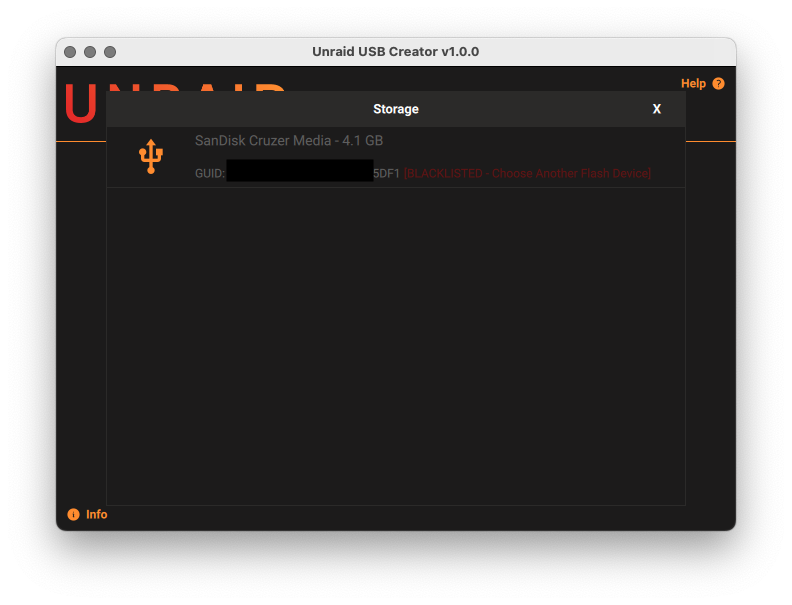

# Unraid USB Creator

Unraid Imaging Utility

[](https://deepwiki.com/unraid/usb-creator-next)

- Download the latest version for Windows, macOS and Ubuntu from the [Unraid download page](https://unraid.net/getting-started).

Based on the work by [Raspberry Pi](https://github.com/raspberrypi/rpi-imager)


## How to use the Unraid USB Creator

Please see our [official documentation](https://docs.unraid.net/unraid-os/getting-started/quick-install-guide/).

## Contributing


### Building on Windows
We use a docker image and MinGW to cross-compile for a windows target. 

Prerequisite: [Docker](https://www.docker.com/)

```sh

# Uses Docker to cross-compile (64-bit MinGW)

# clone repo & switch to right branch
git clone https://github.com/unraid/usb-creator-next.git
git switch v1.9.6-rebase


# build docker image (skip if  built image)
cd src/windows
docker build -f Dockerfile.win64dyn -t ghcr.io/unraid/usb-creator-next/qt6-mxe-env:latest .


# run docker container
# if you run into cmake permissions error, your hard drive/ssd might have an open handle. Temp workaround would be to not use a volume mount in the meantime or run (chkdsk). 
docker run --rm -it -v "<your-repo-root>:/imager-tool" -w /imager-tool --name unraid-usb-creator ghcr.io/unraid/usb-creator-next/qt6-mxe-env:latest

# setup build directory
cd ../..
mkdir build && cd build

# configure --> change BUILD_TYPE to Debug or whatever you want.
cmake ../src -DQt6_DIR=/opt/mxe/usr/x86_64-w64-mingw32.shared/qt6/lib/cmake/Qt6 -DCMAKE_BUILD_TYPE=Release -DIMAGER_SIGNED_APP=OFF -DCMAKE_MESSAGE_LOG_LEVEL=DEBUG

# build
cmake --build . --parallel

# to run locally, the .exe with all of the required dependencies is in build/deploy. 

# The executable will be called unraid-usb-creator.exe --> Make sure you're not trying to run the one in the build folder as that does not contain all of the required dependencies. 

# make the installer (in the docker shell) with:
makensis unraid-usb-creator.nsi

# installer executable will be located in the build folder
# example output file: unraid-usb-creator-1.9.6.exe

```

**NOTE:** If you wish to see logs on windows on the release version, you can run the app via the terminal and add the --debug option to see logs `./unraid-usb-creator-1.9.6.exe --debug`

### Building on macOS
#### Building using Qt Creator
- Open project by selecting cmakelists.txt
- Configure project to use qt 6.9.1 
- build and run

#### Building using vscode/terminal

```sh

# Install QT 6.9.1 from https://doc.qt.io/qt-6/get-and-install-qt.html

# Add QT to path:  
# export PATH="<your-QT-install-dir>/6.9.1/macos/bin:$PATH"

# add cmake if you don't already have it
brew install cmake

git clone https://github.com/unraid/usb-creator-next.git

git switch v1.9.6-rebase

mkdir build && cd build

cmake -DCMAKE_C_COMPILER=/usr/bin/clang -DCMAKE_CXX_COMPILER=/usr/bin/clang++ -DQt6_ROOT="<your-QT-install-dir>/6.9.1/macos" -DCMAKE_BUILD_TYPE=Debug -S ../src -B .
    

cmake --build . --parallel
```


### Linux

#### Building using Qt Creator
- Open project by selecting src/CMakeLists.txt
- Configure project to use Qt 6.9.1 
- build and run


#### Building using vscode/terminal
```sh

# Install QT 6.9.1 from https://doc.qt.io/qt-6/get-and-install-qt.html

# add ninja
sudo apt update
sudo apt install ninja-build 

# add cmake if you don't alr have it
sudo apt install cmake

git clone https://github.com/unraid/usb-creator-next.git

git switch v1.9.6-rebase

mkdir build && cd build

cmake \
  -S ../src \
  -B . \
  -DCMAKE_BUILD_TYPE=Debug \
  -DCMAKE_PREFIX_PATH="<your-QT-install-dir>/6.9.1/gcc_64" \
  -DQt6_DIR="<your-QT-install-dir>/6.9.1/gcc_64/lib/cmake/Qt6" \
  -DQt6_ROOT="<your-QT-install-dir>/6.9.1/gcc_64"
   

cmake --build . --parallel

# run project with root perms
sudo ./unraid-usb-creator
```

## Telemetry

Telemetry is currently disabled on the Unraid USB Creator

## License

The main code of the Imaging Utility is made available under the terms of the Apache license.
See license.txt and files in "src/dependencies" folder for more information about the various open source licenses that apply to the third-party dependencies used such as Qt, libarchive, drivelist, mountutils and libcurl.
For the embedded (netboot) build see also "embedded/legal-info" for more information about the extra system software included in that.


## Images

### Homepage


### OS Selection


### Drive Selection

#### Blacklisted



#### Good Drive


### Options Selection


### Writing in Progress


### Success


