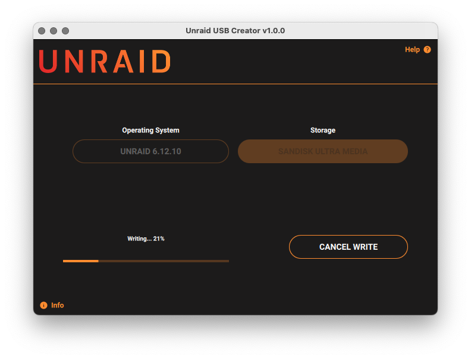

# Unraid USB Creator

Unraid USB Creation Utility

Download the latest version for Windows, macOS and Ubuntu from the [USB Creator Download Page](https://unraid.net/getting-started/).
 


Based on the work by [Raspberry Pi](https://github.com/raspberrypi/rpi-imager)

## How to use the Unraid USB Creator

Please see our [official documentation](https://docs.unraid.net/legacy/FAQ/usb-flash-drive-preparation/).

## License

The main code of the Imaging Utility is made available under the terms of the Apache license.
See license.txt and files in "src/dependencies" folder for more information about the various open source licenses that apply to the third-party dependencies used such as Qt, libarchive, drivelist, mountutils and libcurl.
For the embedded (netboot) build see also "embedded/legal-info" for more information about the extra system software included in that.

## How to rebuild

### Debian/Ubuntu Linux

#### Get dependencies

Install the build dependencies:

```
sudo apt install --no-install-recommends build-essential devscripts debhelper cmake git libarchive-dev libcurl4-gnutls-dev liblzma-dev \
    qtbase5-dev qtbase5-dev-tools qtdeclarative5-dev libqt5svg5-dev qttools5-dev libgnutls28-dev \
    qml-module-qtquick2 qml-module-qtquick-controls2 qml-module-qtquick-layouts qml-module-qtquick-templates2 qml-module-qtquick-window2 qml-module-qtgraphicaleffects
```

#### Get the source

```
git clone --depth 1 https://github.com/unraid/usb-creator-next
```

#### Build the Debian package

```
cd usb-creator-next
debuild -uc -us
```

debuild will compile everything, create a .deb package and put it in the parent directory.
Can install it with apt:

```
cd ..
sudo apt install ./unraid-usb-creator*.deb
```

It should create an icon in the start menu under "Utilities" or "Accessories".
The imaging utility will normally be run as regular user, and will call udisks2 over DBus to perform privileged operations like opening the disk device for writing.
If udisks2 is not functional on your Linux distribution, you can alternatively start it as "root" with sudo and similar tools.

### Fedora/RHEL/CentOS Linux

#### Get dependencies

Install the build dependencies:

```
sudo yum install git gcc gcc-c++ make cmake libarchive-devel libcurl-devel lzma-sdk-devel openssl-devel qt5-qtbase-devel qt5-qtquickcontrols2-devel qt5-qtsvg-devel qt5-linguist xz-devel
```

#### Get the source

```
git clone --depth 1 https://github.com/unraid/usb-creator-next
```

#### Build and install the software

```
cd rpi-imager
mkdir -p build
cd build
cmake ../src
make
sudo make install
```

### Windows

#### Get Windows dependencies

- Get the Qt online installer from: https://www.qt.io/download-open-source
During installation, choose a Qt 5.x with Mingw32 32-bit toolchain and CMake.

- If using the official Qt distribution that does NOT have schannel (Windows native SSL library) support, compile OpenSSL libraries ( https://wiki.qt.io/Compiling_OpenSSL_with_MinGW ) and copy the libssl/crypto DLLs to C:\qt\5.x\mingw73_32\bin  the include files to C:\qt\5.x\mingw73_32\include and the import library files to C:\qt\5.x\mingw73_32\lib

- For building installer get Nullsoft scriptable install system: https://nsis.sourceforge.io/Download

- It is assumed you already have a proper code signing certificate, and signtool.exe from the Windows SDK installed.
If NOT and are you only compiling for your own personal use, comment out all lines mentioning signtool from CMakelists.txt and the .nsi installer script.

#### Building on Windows

Building can be done manually using the command-line, using "cmake", "make", etc., but if you are not that familar with setting up a proper Windows build environment (setting paths, etc.), it is easiest to use the Qt creator GUI instead.

- Download source .zip from github and extract it to a folder on disk
- Open src/CMakeLists.txt in Qt creator.
- For builds you distribute to others, make sure you choose "Release" in the toolchain settings and not the debug flavour.
- Menu "Build" -> "Build all"
- Result will be in build_unraid-usb-creator_someversion
- Go to the BUILD folder, right click on the .nsi script "Compile NSIS script", to create installer.

Note: the CMake integration in Qt Creator is a bit flaky at times. If you made any custom changes to the CMakeLists.txt file and it subsequently gets in an endless loop where it never finishes the "configures" stage while re-processing the file, delete "build_unraid-usb-creator_someversion" directory and try again.

#### Signing

To sign the .exe installer on Windows, [follow these instructions](https://github.com/unraid/digicert-keylockertools) (private repo)

### macOS

#### Get macOS dependencies

- Get the Qt online installer from: https://www.qt.io/download-open-source
During installation, choose a Qt 5.x edition and CMake.
- For creating a .DMG for distribution you can use an utility like: https://github.com/sindresorhus/create-dmg
- It is assumed you have an Apple developer subscription, and already have a "Developer ID" code signing certificate for distribution outside the Mac Store. (Privileged apps are not allowed in the Mac store)

#### Building on Mac

- Download source .zip from github and extract it to a folder on disk
- Start Qt Creator (may need to start "finder" navigate to home folder using the "Go" menu, and find Qt folder to start it manually as it may not have created icon in Applications), and open src/CMakeLists.txt
- Menu "Build" -> "Build all"
- Result will be in build_unraid-usb-creator_someversion
- Install create-dmg for signing `brew install create-dmg`

#### Signing on Mac

For distribution to others:

1. code sign the .app
2. create a DMG
3. submit the DMG for notarization to Apple
4. staple the notarization ticket to the DMG.

E.g.:

```sh
cd build-rpi-imager-Desktop_Qt_5_14_1_clang_64bit-Release/
codesign --deep --force --verify --verbose --sign "YOUR KEYID" --options runtime unraid-usb-creator.app
mv unraid-usb-creator.app "Unraid USB Creator.app"
create-dmg "Unraid USB Creator.dmg" "Unraid USB Creator.app" 
mv Unraid\ USB\ Creator.dmg imager.dmg
xcrun notarytool submit "Unraid USB Creator.dmg"  --apple-id YOUR-EMAIL-ADDRESS --password YOUR-APP-SPECIFIC-APPLE-PASSWORD --team-id TEAM-ID-FOUND-ON-https://developer.apple.com/account
xcrun notarytool wait SUBMISSION_ID --apple-id YOUR-EMAIL-ADDRESS --password YOUR-APP-SPECIFIC-APPLE-PASSWORD --team-id TEAM-ID-FOUND-ON-https://developer.apple.com/account
xcrun stapler staple "Unraid USB Creator.dmg"
```

## Other notes

### Debugging

On Linux and Mac the application will print debug messages to console by default if started from console.
On Windows start the application with the command-line option --debug to let it open a console window.

### Custom repository

If the application is started with "--repo [your own URL]" it will use a custom image repository.
So can simply create another 'start menu shortcut' to the application with that parameter to use the application with your own images.

### Telemetry

Telemetry is currently disabled on the Unraid USB Creator
### Images

#### Homepage


#### OS Selection


#### Drive Selection

Blacklisted


Good Drive


#### Options Selection


#### Writing in Progress



#### Success


